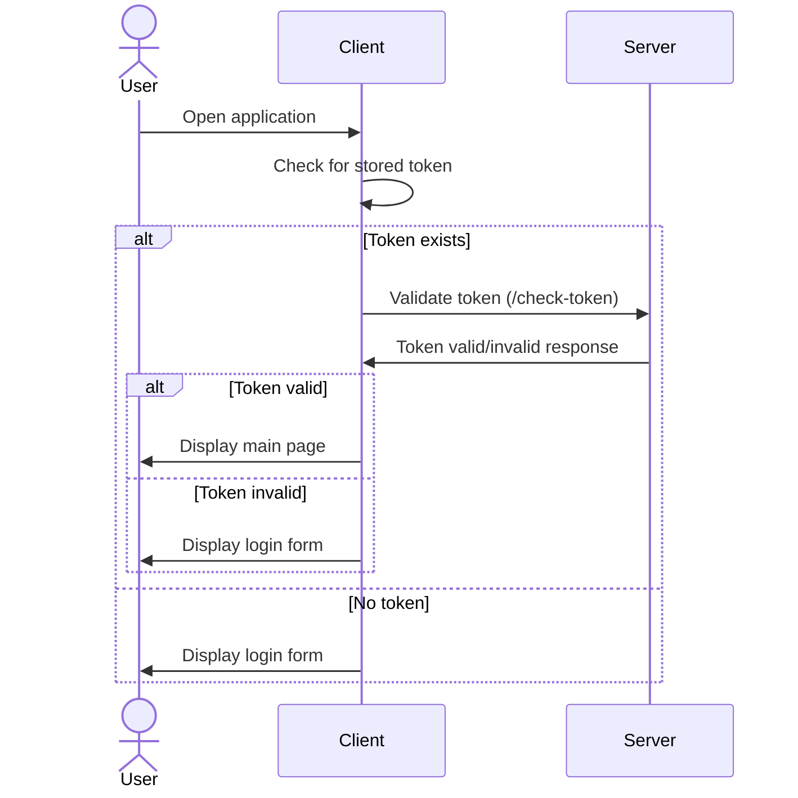
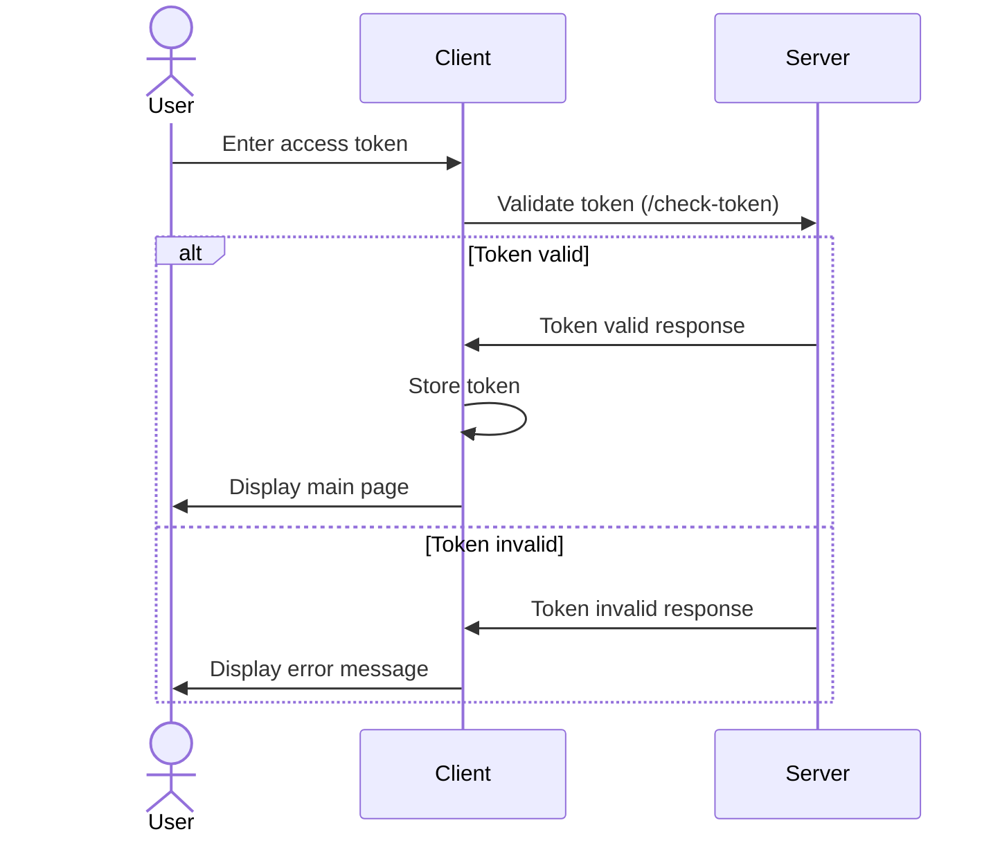
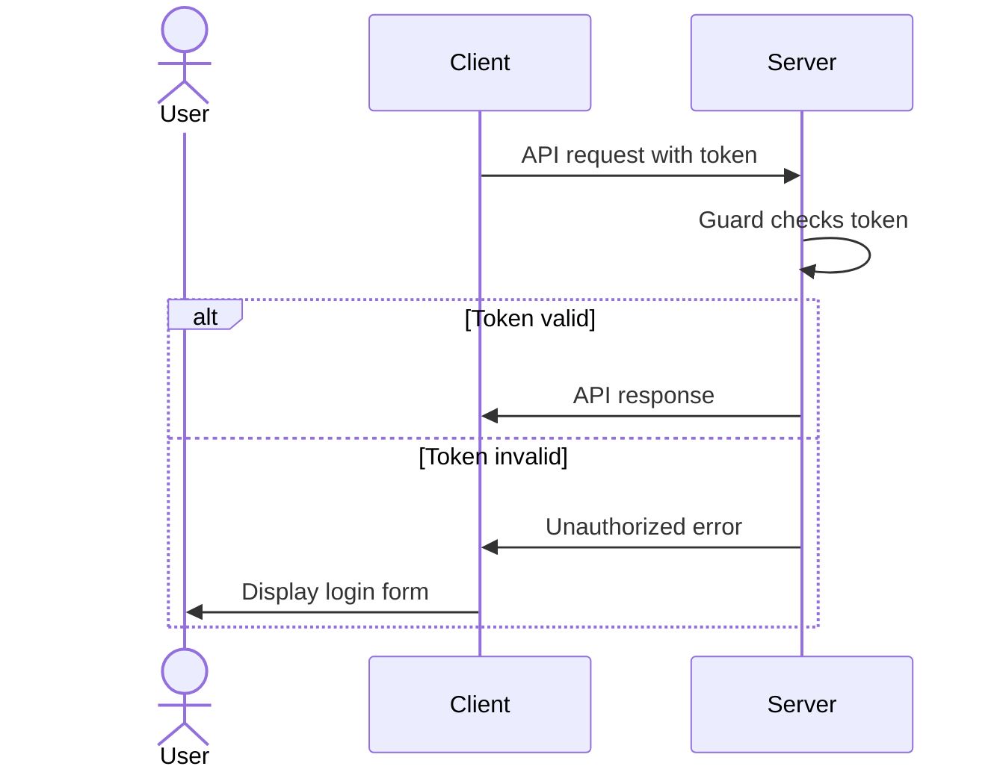
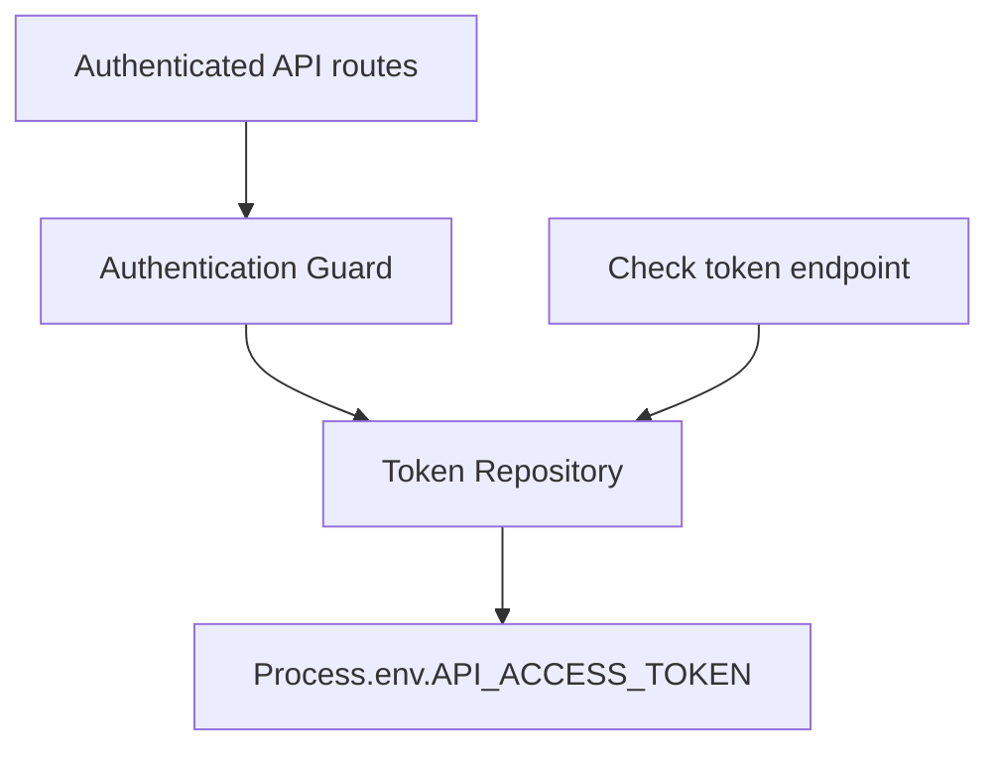
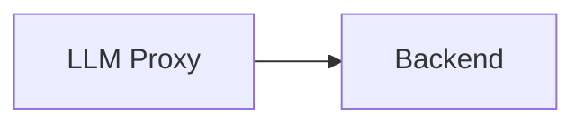
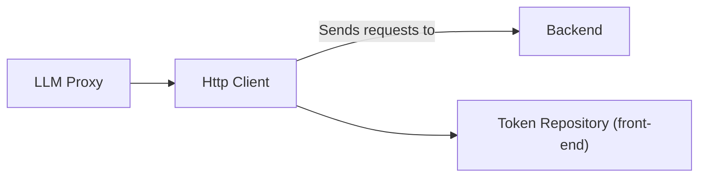
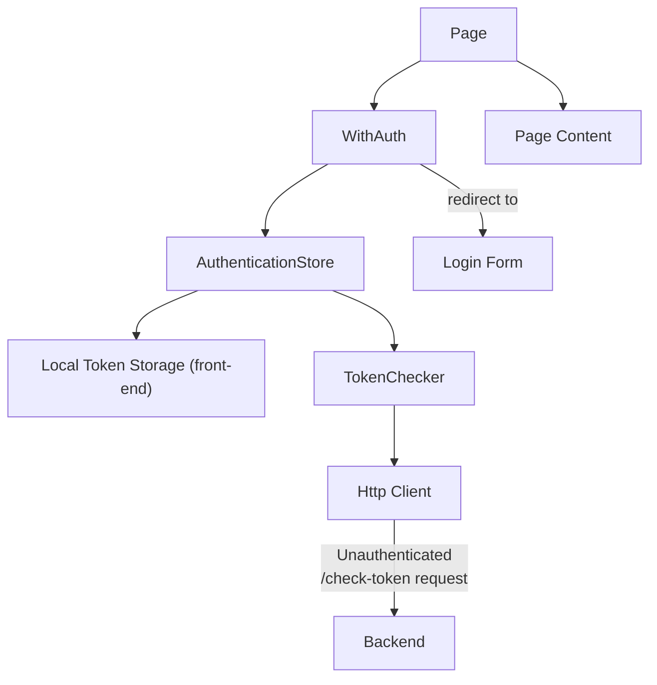

# Goal
Implement a very simple authentication system for the app.

# Functional Requirements

- There should be a login component that allows users to enter a hardcoded access token.
- If the access token is correct, the user should be redirected to the main page
- Every API request should be authenticated with the access token

# Anticipated future requirements

- Users will be able to log in either with username/password or with a federated identity provider
- Each user will have a unique access token

# Design

## Client-side

Wrap the app in a component that checks the validity of the access token, and displays a login form if it's invalid.
If the access token is valid, display the main page. Otherwise, display a simple text input field for the user to enter the access token.

When the text input is submitted, send an API request to the server to validate the access token.

## Server-side

- Implement a simple Guard that checks the validity of the access token, and set the guard in the controllers that require authentication..
- Implement a /check-token endpoint that accepts the access token and returns a boolean indicating whether the token is valid or not.

# Overall flow

## Application startup

## Login process

## API requests

# Software components

## Backend

### Check token endpoint

Simple controller that accepts the access token and check it against an environment variable.

### Authentication guard

Simple guard that checks the validity of the access token using the environment variable.

## Frontend

## API requests

Current architecture:

New architecture:

## Authentication structure

# Implementation steps

- [X] /check-token endpoint (+ token repository on backend)
- [X] HTTP client without auth (refactor existing LLM Proxy to use it)
  - [X] Make the HTTP client a singleton
- [ ] Authentication checker / Token Repository (front-end) / Token Checker / Login Form
  - [X] Add LocalTokenStorage
  - [X] Add the TokenChecker service
  - [X] Add authentication store
  - [ ] Add simple login form component
  - [ ] Add the AuthenticationChecker component / context to the app
- [ ] Add authentication to HTTP client
  - [ ] Add setToken method to ContextGptSdk
  - [ ] In ContextGptSdk, send the token in the Authorization header when it is set
- [ ] Require authentication in backend routes
  - [ ] Add global guard to check authentication token
  - [ ] Disable global guard for specific unauthenticated routes such as /check-token and /health
