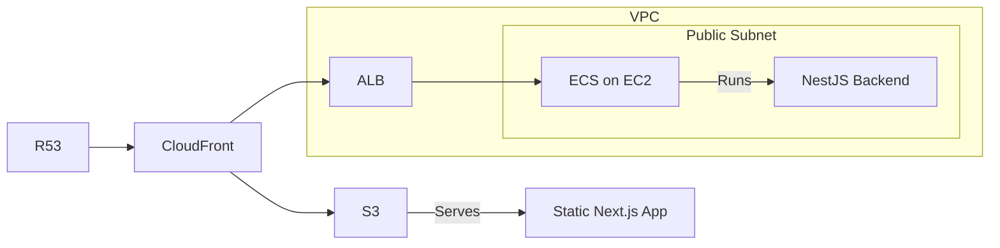

# Goal

Deploy the application to AWS.

# Design

## Infrastructure diagram

Design note: 

- The NestJS backend needs public internet access to make API calls to the Anthropic API. 
To save on NAT Gateway costs, we'll put the EC2 instance in the public subnet, and we'll use the Internet Gateway.
- As a first step, we'll deploy the EC2 instance in the default VPC / default subnet. We will not create a custom VPC for now.

## Implementation steps

- [X] Dockerize the NestJS backend
  - [X] Create a Dockerfile
  - [X] Build the Docker image
  - [X] Verify that the Docker image is working by running it locally
  - [X] Add an Nx target to build the Docker image
- [X] Automate the push of the Docker Image to ECR
  - [X] (Optional but recommended) Integrate the Automation in Nx targets 
- [ ] Write an IaC Pulumi script to deploy the app
  - [X] Setup a Pulumi infrastructure app
  - [X] Create an S3 bucket
  - [X] Make sure the simple pulumi script works
  - [ ] Sync the Next.js out directory with the S3 bucket
  - [ ] Provision an EC2 instance (free tier)
  - [ ] Configure the security group of the EC2 instance to allow inbound traffic from the ALB's security group on application port (8000)
  - [ ] Configure the security group of the EC2 instance to allow outbound traffic to the internet
  - [ ] Create an ECS cluster that uses the EC2 instance
  - [ ] Create a task definition for the backend
  - [ ] Create an ALB
  - [ ] Configure the ALB to use the ECS cluster as a target
  - [ ] Configure the security group of the ALB to allow inbound traffic on port 443 and 80
  - [ ] Configure the security group of the ALB to allow outbound traffic to the application port (8000)
  - [ ] Create a CloudFront distribution
  - [ ] Create an OAC to prevent direct access to the S3 bucket
  - [ ] Point the default behavior to S3
  - [ ] Point the /api behavior to the ALB
  - [ ] Link ACM to CloudFront
  - [ ] Configure the Route53 hosted zone to point to CloudFront
