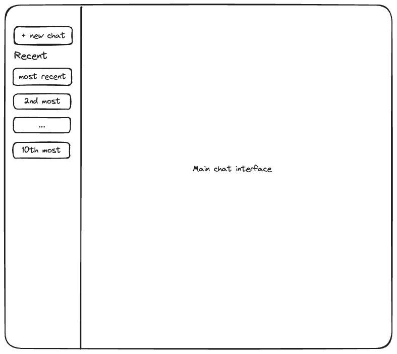
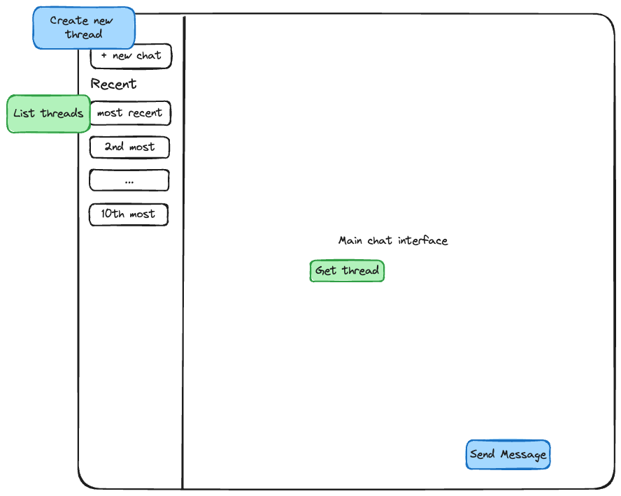
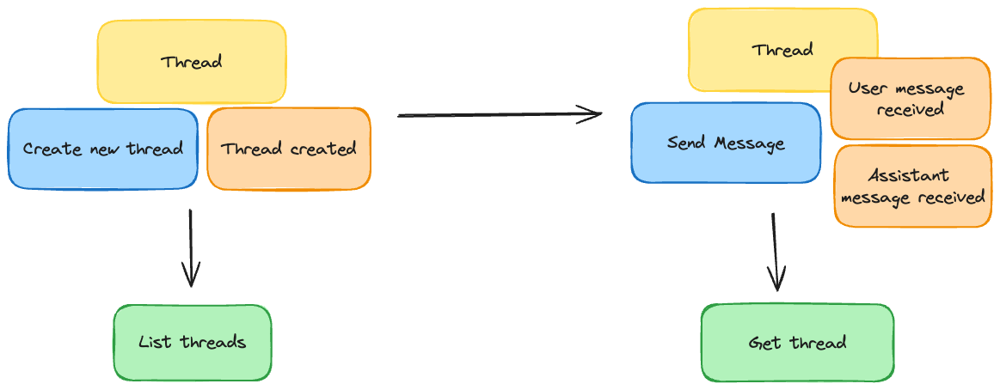
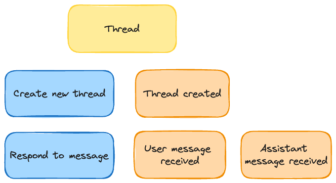

# Goal

Have a chat history that persists across sessions.

# Wireframe

# Design

## Frontend

## Backend

# Event flow

### Aggregate

# Implementation steps

## Step 1

Singleton persistent thread. GET Thread always returns the same thread that is stored in memory.

## Step 2

Multiple threads, stored in memory. Each thread has a unique ID. 
