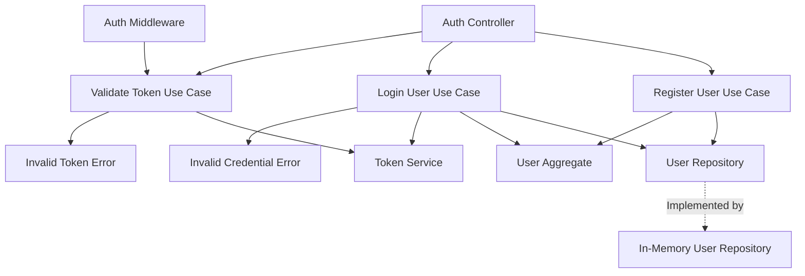

Based on the provided sequence diagram and the backend project structure, I'll design a solution for implementing a minimal authorization system. Here's the design document:

The proposed solution follows the hexagonal architecture and consists of the following components:

1. Auth Controller (Adapter):
  - Handles HTTP requests for registration, login, and authenticated API calls.
  - Translates incoming requests into use case inputs and use case outputs into HTTP responses.

2. Auth Middleware (Adapter):
  - Intercepts incoming requests to protected routes.
  - Extracts the session token from the request and validates it using the Validate Token Use Case.

3. Register User Use Case:
  - Handles the user registration process.
  - Creates a new User Aggregate and stores it using the User Repository.

4. Login User Use Case:
  - Handles the user login process.
  - Validates user credentials using the User Repository.
  - Generates a session token using the Token Service if credentials are valid.

5. Validate Token Use Case:
  - Validates the session token using the Token Service.

6. User Aggregate (Domain):
  - Represents the user entity and encapsulates user-related business logic.
  - Responsible for maintaining user data integrity and enforcing business rules.

7. Token Service (Domain):
  - Handles the generation and validation of session tokens.

8. User Repository (Port):
  - Defines the interface for user data persistence operations.

9. In-Memory User Repository (Infrastructure):
  - Implements the User Repository interface using in-memory storage.

This design adheres to the principles of hexagonal architecture:
- The domain layer (User Aggregate and Token Service) contains the core business logic.
- Use cases form the application layer, orchestrating interactions between the domain and infrastructure.
- Adapters (Auth Controller and Auth Middleware) handle external interactions.
- The User Repository port allows for easy swapping of storage implementations.

The solution provides a clear separation of concerns, making it easy to extend or modify individual components without affecting the entire system.

1. Set up the project structure
   - [X] Create the auth library folder structure in the monorepo
2. Implement the Domain layer
   - [X] Create the User Aggregate
     - [X] Implement methods for creating a user and validating credentials
   - [X] Create the Token Service
     - [X] Implement methods for generating and validating session tokens
3. Define the Ports
   - [X] Create the User Repository abstract class
     - [X] Define methods for saving a user and retrieving a user by email.
4. Implement the Infrastructure layer
   - [X] Create the In-Memory User Repository
     - [X] Implement the User Repository interface using in-memory storage
5. Implement the Use Cases
   - [X] Create the Register User Use Case
     - [X] Implement logic to create a new user using the User Aggregate and User Repository
   - [X] Create the Login User Use Case
     - [X] Implement logic to validate credentials and generate a session token
   - [X] Create the Validate Token Use Case
     - [X] Implement logic to validate a session token using the Token Service

6. Implement the Adapters
   - [X] Create the Auth Controller
     - [X] Implement POST /auth/register endpoint
       - [X] The POST /auth/register should return 201 Created if the registration is successful
       - [X] The POST /auth/register should not return a body.
       - [X] The POST /auth/register should return a 400 Bad Request if the registration fails due to invalid input
     - [X] Implement POST /auth/login endpoint
       - [X] The POST /auth/login should return 200 OK along with a session token if the credentials are valid, and 401 Unauthorized if the credentials are invalid.
       - [X] The POST /auth/login should return a 401 Unauthorized error if the credentials are invalid.
     - [X] Implement GET /auth/validate endpoint
       - [X] The GET /auth/validate should return 200 OK if the token is valid, and 401 Unauthorized if the token is invalid.
       - [X] The token should be extracted from the Authorization header
   - [ ] Create the Auth Guard
     - [ ] The Auth Guard extracts the session token from the authorization header
     - [ ] The Auth Guard checks that the token is well-formed (`Bearer <token>`)
     - [ ] The Auth Guard checks that the token is valid using the Validate Token Use-Case
     - [ ] The Auth Guard sets the user ID in the request context

7. Configure the Auth Module
   - [ ] Create the auth.module.ts file
   - [ ] Configure dependencies and export necessary components

8. Integration and Testing
   - [ ] Integrate the Auth Module into the main application
   - [ ] Write unit tests for each component
   - [ ] Write integration tests for the authentication flow
9. Security Considerations
   - [X] Implement password hashing in the User Aggregate
