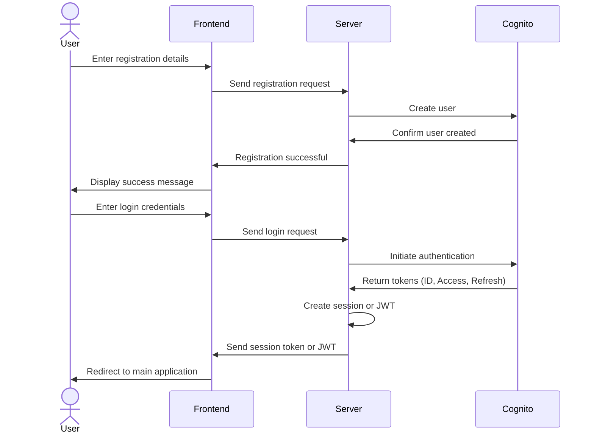
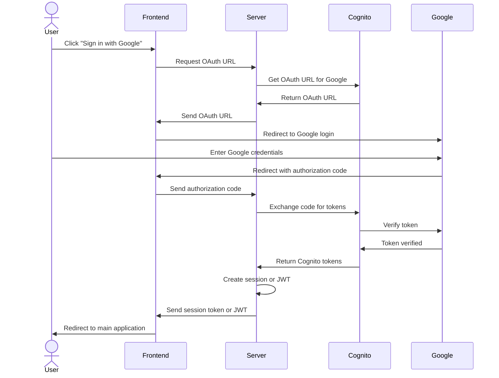
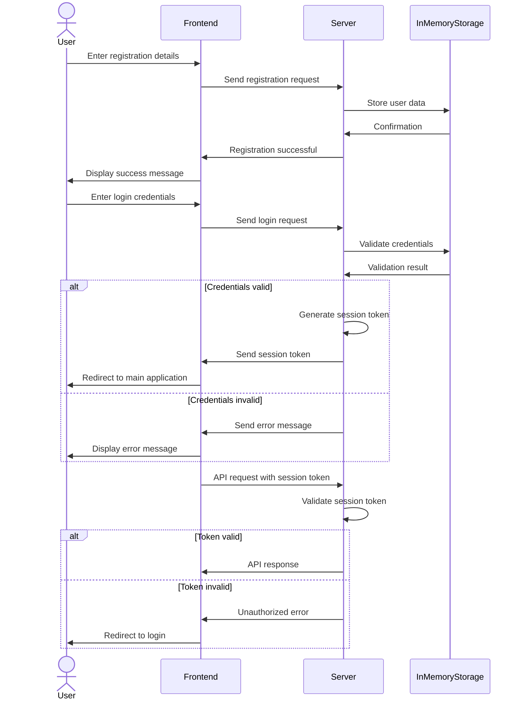

# Planned flows

User registration and login flow

```mermaid
sequenceDiagram
    actor User
    participant Frontend
    participant Server
    participant Cognito

    %% Registration
    User->>Frontend: Enter registration details
    Frontend->>Server: Send registration request
    Server->>Cognito: Create user
    Cognito->>Server: Confirm user created
    Server->>Frontend: Registration successful
    Frontend->>User: Display success message

    %% Login
    User->>Frontend: Enter login credentials
    Frontend->>Server: Send login request
    Server->>Cognito: Initiate authentication
    Cognito->>Server: Return tokens (ID, Access, Refresh)
    Server->>Server: Create session or JWT
    Server->>Frontend: Send session token or JWT
    Frontend->>User: Redirect to main application
```

External identity provider flow

```mermaid
sequenceDiagram
    actor User
    participant Frontend
    participant Server
    participant Cognito
    participant Google

    User->>Frontend: Click "Sign in with Google"
    Frontend->>Server: Request OAuth URL
    Server->>Cognito: Get OAuth URL for Google
    Cognito->>Server: Return OAuth URL
    Server->>Frontend: Send OAuth URL
    Frontend->>Google: Redirect to Google login
    User->>Google: Enter Google credentials
    Google->>Frontend: Redirect with authorization code
    Frontend->>Server: Send authorization code
    Server->>Cognito: Exchange code for tokens
    Cognito->>Google: Verify token
    Google->>Cognito: Token verified
    Cognito->>Server: Return Cognito tokens
    Server->>Server: Create session or JWT
    Server->>Frontend: Send session token or JWT
    Frontend->>User: Redirect to main application
```

## First step (no Cognito integration)

```mermaid
sequenceDiagram
    actor User
    participant Frontend
    participant Server
    participant InMemoryStorage

    %% Registration
    User->>Frontend: Enter registration details
    Frontend->>Server: Send registration request
    Server->>InMemoryStorage: Store user data
    InMemoryStorage->>Server: Confirmation
    Server->>Frontend: Registration successful
    Frontend->>User: Display success message

    %% Login
    User->>Frontend: Enter login credentials
    Frontend->>Server: Send login request
    Server->>InMemoryStorage: Validate credentials
    InMemoryStorage->>Server: Validation result
    alt Credentials valid
        Server->>Server: Generate session token
        Server->>Frontend: Send session token
        Frontend->>User: Redirect to main application
    else Credentials invalid
        Server->>Frontend: Send error message
        Frontend->>User: Display error message
    end

    %% Authenticated request
    Frontend->>Server: API request with session token
    Server->>Server: Validate session token
    alt Token valid
        Server->>Frontend: API response
    else Token invalid
        Server->>Frontend: Unauthorized error
        Frontend->>User: Redirect to login
    end
```
