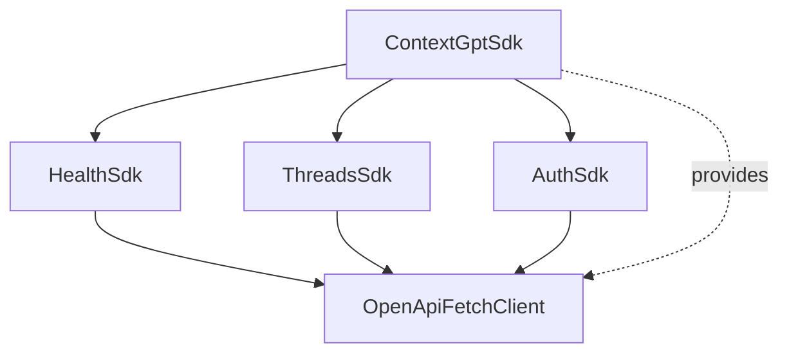

# SDK Rework

## Goal

The sdk currently has all of its logic in a single file, and all its tests in a single file. This will make it difficult to maintain and test.
We want to split the sdk into multiple files, with one file per backend bounded context.

## Design

Move the Health function into its own file

Move the Threads related functions into their own file

Move the Authentication related functions into their own file.

Target signature for the SDK:

```ts
const sdk = new ContextGptSdk();
sdk.setAccessToken('access_token');

const health = await sdk.health.check();

const postMessageResponse = await sdk.threads.postMessage(...);

const loginResponse = await sdk.auth.login(...);
```

## Implementation strategy

- Create separate sub-sdks for each bounded context.

Dependency graph:



## Implementation steps

- [ ] Create the Health SDK
  - [ ] Create the test file
  - [ ] Create the implementation file
- [ ] Create the Threads SDK
  - [ ] Create the test file
  - [ ] Create the implementation file
- [ ] Create the Auth SDK
  - [ ] Create the test file
  - [ ] Create the implementation file
- [ ] Create the main SDK file
