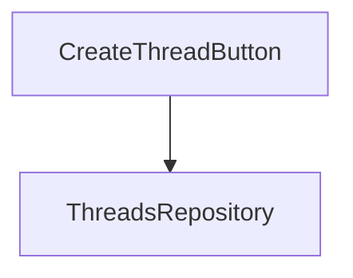

# Goal

Integrate the new create / post-message API into the front-end of the application.

# Questions

Q: What is the current API endpoints available for interacting with the threads?  
A: POST /threads: create a new thread  
POST /threads/{id}/messages: post a message to a thread

Q: How do we enable users to create a new thread from the UI?  
A: Add a rudimentary sidebar with a button to create a new thread

Q: How do we enable users to post a message to a thread from the UI?  
A: Keep the existing chat interface

Q: Where do we store the thread id when accessing the chat interface?  
A: Store it in the URL

# Approach / Design

# Implementation steps

- [X] Create a create thread feature
  - [X] Create a Thread model (id and messages).
  - [X] Create a ThreadsRepository that handles the underlying backend call
    - [X] Create a fake implementation of the ThreadsRepository for testing
    - [X] Create an implementation of the ThreadsRepository that uses the threads SDK
  - [ ] Create a headless component that handles the button click
  - [ ] Create a view layer that renders a simple button
  - [ ] Make creating a new thread redirect to the chat interface with the thread id in the URL

- [ ] Create a simple sidebar component

- [ ] Update the existing chat feature to conform to the new API (single message instead of whole thread, and need for a thread id)
  - [ ] Add a method for posting a message in the ThreadsRepository
    - [ ] Update the fake implementation with the new method
    - [ ] Update the implementation of the ThreadsRepository that uses the threads SDK with the new method
  - [ ] Use the threads repository in the chat store instead of the current LLMProxy class
  - [ ] Read the thread id from the URL and pass it to the chat store at initialization
  - [ ] Update the chat page to have the sidebar component
