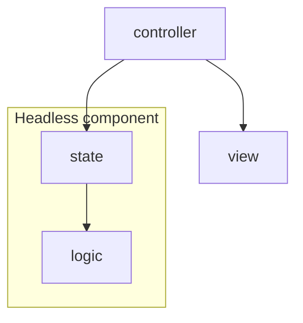

# Anatomy of a component

A component is made up of three main layers:
- View layer: this layer is made up of markup and styling (tsx and tailwind classes in our project)
- State (reactive) layer: this layer is responsible maintaining the reactive state of the application and making it accessible to
the view layer
- Logic layer: this layer is responsible for handling all the business logic of the component

Additionally, the "Controller layer" is responsible for gluing together the view and state layers.

How the layer are represented in code:

- `<component-name>.view.tsx` : View layer
- `<component-name>.tsx` Controller layer
- `<component-name>.state.tsx` : State layer
- `<component-name>.logic.tsx` : Logic layer

The combination of the state and logic layer is called a **headless component**

In the most simple cases, a component could group its three layers in a single file. However, 
the separation of the layers should be seen even in the simplest case, e.g:

```tsx
// counter.tsx

// view + controller layers
export function Counter() {
  const { count, increment } = useCounter();
  
  return (
    <div>
      <h1>{count}</h1>
      <button onClick={increment}>Increment</button>
    </div>
  );
}

// state layer
function useCounter() {
  const [count, setCount] = useState(() => initCount());
  
  const increment = () => setCount(prev => increment(prev));
}

// logic layer
function initCount() {
  return 0;
}

function increment(count: number) {
  return count + 1;
}
```

## Dependency graph


