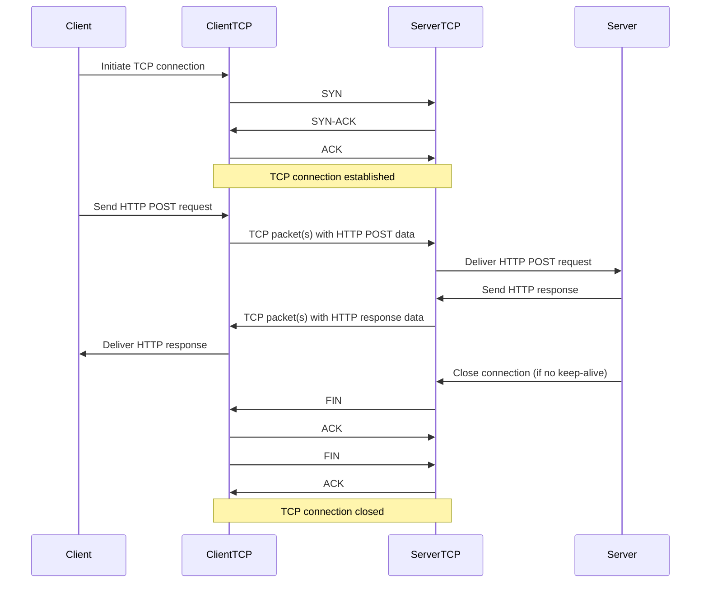
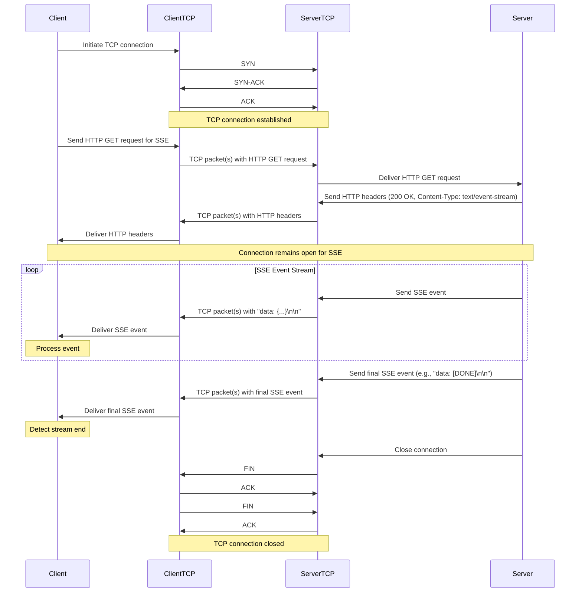

# Normal POST request flow 

```mermaid
sequenceDiagram
    participant Client
    participant ClientTCP
    participant ServerTCP
    participant Server

    Client->>ClientTCP: Initiate TCP connection
    ClientTCP->>ServerTCP: SYN
    ServerTCP->>ClientTCP: SYN-ACK
    ClientTCP->>ServerTCP: ACK
    Note over ClientTCP,ServerTCP: TCP connection established

    Client->>ClientTCP: Send HTTP POST request
    ClientTCP->>ServerTCP: TCP packet(s) with HTTP POST data
    ServerTCP->>Server: Deliver HTTP POST request

    Server->>ServerTCP: Send HTTP response
    ServerTCP->>ClientTCP: TCP packet(s) with HTTP response data
    ClientTCP->>Client: Deliver HTTP response

    Server->>ServerTCP: Close connection (if no keep-alive)
    ServerTCP->>ClientTCP: FIN
    ClientTCP->>ServerTCP: ACK
    ClientTCP->>ServerTCP: FIN
    ServerTCP->>ClientTCP: ACK
    Note over ClientTCP,ServerTCP: TCP connection closed
```

# SSE request flow

```mermaid
sequenceDiagram
    participant Client
    participant ClientTCP
    participant ServerTCP
    participant Server

    Client->>ClientTCP: Initiate TCP connection
    ClientTCP->>ServerTCP: SYN
    ServerTCP->>ClientTCP: SYN-ACK
    ClientTCP->>ServerTCP: ACK
    Note over ClientTCP,ServerTCP: TCP connection established

    Client->>ClientTCP: Send HTTP GET request for SSE
    ClientTCP->>ServerTCP: TCP packet(s) with HTTP GET request
    ServerTCP->>Server: Deliver HTTP GET request

    Server->>ServerTCP: Send HTTP headers (200 OK, Content-Type: text/event-stream)
    ServerTCP->>ClientTCP: TCP packet(s) with HTTP headers
    ClientTCP->>Client: Deliver HTTP headers

    Note over Client,Server: Connection remains open for SSE

    loop SSE Event Stream
        Server->>ServerTCP: Send SSE event
        ServerTCP->>ClientTCP: TCP packet(s) with "data: {...}\n\n"
        ClientTCP->>Client: Deliver SSE event
        Note over Client: Process event
    end

    Server->>ServerTCP: Send final SSE event (e.g., "data: [DONE]\n\n")
    ServerTCP->>ClientTCP: TCP packet(s) with final SSE event
    ClientTCP->>Client: Deliver final SSE event

    Note over Client: Detect stream end

    Server->>ServerTCP: Close connection
    ServerTCP->>ClientTCP: FIN
    ClientTCP->>ServerTCP: ACK
    ClientTCP->>ServerTCP: FIN
    ServerTCP->>ClientTCP: ACK
    Note over ClientTCP,ServerTCP: TCP connection closed
```
